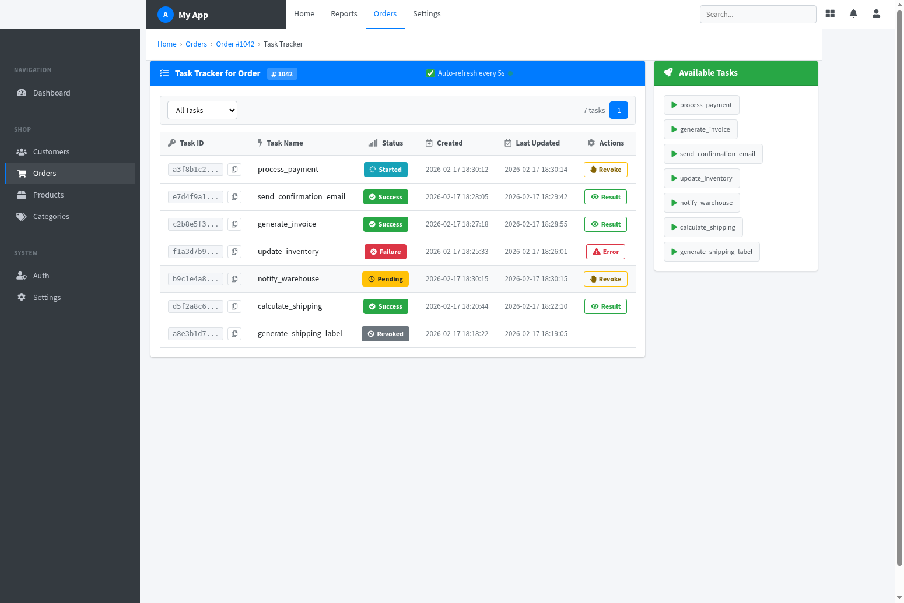
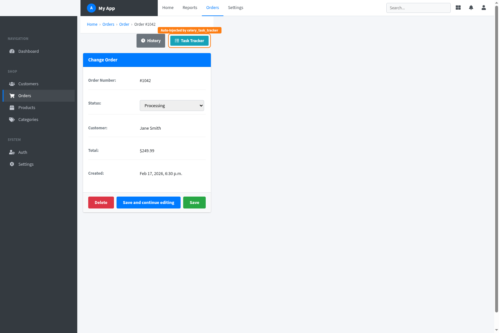

# django-celery-tracker

Per-instance Celery task tracking for Django models, built into the admin.

> Works best with [django-jazzmin](https://github.com/farridav/django-jazzmin) for a polished admin experience.



---

## The Problem

Django projects that use Celery often end up with background tasks tied to specific model instances — processing an order, generating a report, syncing a record. When something goes wrong, the only way to find out is to dig through Celery logs, check Flower, or query your result backend manually. There's no built-in way to look at a model instance in the admin and see what tasks ran against it, whether they succeeded, or what went wrong.

This library solves that.

## What It Does

You register Celery tasks against Django models. From that point on, every time one of those tasks runs, its lifecycle is tracked and tied to the specific model instance it was called with.

- Adds a **Task Tracker** button to the Django Admin for any registered model.
- Shows a live dashboard of every Celery task tied to that specific instance, identified by its ID.
- Lets you **launch** registered tasks and **revoke** running ones directly from the admin.
- Tracks full task lifecycle: Pending, Received, Started, Success, Failure, Revoked, Rejected.
- Stores everything in Redis with automatic expiry. No database tables, no migrations.
- Auto-refreshes the dashboard every 5 seconds with filtering by task name or status.

---

## How Model-Instance Tracking Works

The core idea: every Celery task you register is associated with a Django model. When the task runs, the library figures out which model instance it belongs to (using the task arguments) and stores the task record under that instance's ID in Redis.

For example, if you register a task against `Order` and call it with `order_id=1042`, the library stores that task under `Order #1042`. When you open Order #1042 in the admin and click "Task Tracker", you see only the tasks that ran for that specific order — not all orders, just that one.

This works through Celery signals. The library listens to `after_task_publish`, `task_prerun`, `task_success`, `task_failure`, and `task_revoked`. Each signal updates the task record in Redis, so the dashboard always reflects the current state.

### The flow

1. You call `process_payment.delay(order_id=1042)`.
2. Celery publishes the task. The library catches the `after_task_publish` signal and creates a Redis record for this task, indexed under `Order:1042`.
3. A worker picks it up. `task_prerun` fires. The record updates to "Started".
4. The task finishes. `task_success` or `task_failure` fires. The record updates with the final state and result (or error traceback).
5. You open Order #1042 in the admin, click "Task Tracker", and see the full history.



*The "Task Tracker" button is automatically injected into the admin for any model you register tasks against.*

---

## Installation

```bash
pip install django-celery-tracker
```

### Requirements

| Dependency | Version  |
|------------|----------|
| Python     | >= 3.10  |
| Django     | >= 4.2   |
| Celery     | >= 5.0   |
| Redis      | >= 4.0   |

---

## Setup

### 1. Add to `INSTALLED_APPS`

```python
INSTALLED_APPS = [
    # ...
    "celery_task_tracker",
    # ...
]
```

### 2. Set the Redis URL (optional)

By default it connects to `redis://`. Override it in your Django settings:

```python
CELERY_TASKTRACKER_REDIS_URL = "redis://localhost:6379/1"
```

That's it. No migrations needed.

---

## Usage

### Register a task

Use the `@task_tracker.register()` decorator on your Celery tasks, passing the model class you want to track against:

```python
from celery import shared_task
from celery_task_tracker import task_tracker
from myapp.models import Order

@task_tracker.register(Order)
@shared_task
def process_payment(order_id):
    order = Order.objects.get(pk=order_id)
    # do work...
```

The first positional argument is assumed to be the model's primary key. When `process_payment(42)` runs, the task is tracked under `Order` with ID `42`.

### Custom argument mapping

When the task signature doesn't start with a plain PK, tell the tracker how to find the model instance:

```python
from celery_task_tracker import task_tracker, FromModel

@task_tracker.register(
    Order,
    id_query=("account_id", "reference"),
    launch_args=(FromModel("account_id"), FromModel("reference")),
)
@shared_task
def fulfill_order(account_id: int, reference: str):
    # ...
```

Here the library uses `account_id` and `reference` to look up the `Order` instance, and when launching the task from the admin, it pulls those values from the model instance automatically.

**Parameters:**

| Parameter       | Type                    | Description                                                                 |
|-----------------|-------------------------|-----------------------------------------------------------------------------|
| `model_class`   | Django Model class      | The model to associate the task with.                                       |
| `id_query`      | `str`, `tuple`, `dict`, or `None` | How to resolve the model instance ID from task arguments. `None` means use the first positional arg as PK. A string names a specific kwarg. A tuple/list of field names triggers a DB lookup. A dict maps lookup fields to arg names. |
| `launch_args`   | `tuple` or `None`       | Positional args to pass when launching the task from the admin. Use `FromModel("field")` to pull values from the model instance. |
| `launch_kwargs` | `dict` or `None`        | Keyword args for the task launch. Same `FromModel` support.                 |
| `hidden`        | `bool`                  | If `True`, the task is tracked but won't appear in the "Available Tasks" panel. |

### `FromModel`

`FromModel` is a field reference that resolves a value from a model instance at launch time. It supports dotted paths for related fields:

```python
FromModel("customer.email")  # follows customer FK, gets email
```

### Register one task for multiple models

You can stack `register()` calls to track the same task under different models:

```python
@task_tracker.register(Warehouse)
@task_tracker.register(Product, id_query="product_id")
@shared_task
def restock_product(warehouse_id, product_id):
    # ...
```

This task will appear in the tracker for both the `Warehouse` instance and the `Product` instance.

### Hidden tasks

If a task should be tracked but not shown in the "Available Tasks" launch panel:

```python
@task_tracker.register(Order, hidden=True)
@shared_task
def internal_cleanup(order_id):
    # ...
```

---

## Admin Dashboard

The library automatically patches the Django Admin for any model you register tasks against. No extra configuration needed.

What you get:

- **Task history table** — Task ID, name, status badge, created/updated timestamps, and action buttons.
- **Available Tasks panel** — One-click launch for all registered (non-hidden) tasks for that instance.
- **Filtering** — Filter by task name or status.
- **Pagination** — Configurable page size.
- **Auto-refresh** — Polls every 5 seconds (toggleable).
- **Copy task ID** — Click to copy the full Celery task ID.
- **View result/error** — Modal with the task result or full error traceback.
- **Revoke** — Cancel pending or running tasks.

---

## Configuration

All settings are optional. Add them to your Django `settings.py`:

| Setting                          | Default      | Description                              |
|----------------------------------|--------------|------------------------------------------|
| `CELERY_TASKTRACKER_REDIS_URL`   | `"redis://"`  | Redis connection URL.                    |
| `TASK_TRACKER_RETENTION_WINDOW`  | `86400`       | How long task records live in Redis (seconds). Default: 24 hours. |
| `TASK_TRACKER_PAGE_SIZE`         | `10`          | Number of tasks per page in the dashboard. |
| `TASK_TRACKER_MAX_PAGE_SIZE`     | `200`         | Maximum allowed page size.               |

---

## Architecture

```
celery_task_tracker/
├── __init__.py          # Public API: task_tracker, TaskTrackerConfig, FromModel
├── apps.py              # Django AppConfig — auto-discovers tasks.py in installed apps
├── config.py            # Reads settings from Django settings
├── tracker.py           # Main orchestrator (singleton)
├── task_tracker.py      # Singleton instance
├── registry.py          # Task registration, model-task associations, admin patching
├── signals.py           # Celery signal handlers for lifecycle tracking
├── storage.py           # Redis storage layer (hashes + sorted set indexes)
├── utils.py             # Singleton decorator
├── views.py             # Django views for the admin UI and API
├── urls.py              # URL routing
├── templatetags/
│   └── task_humanize.py # Template filter for task name display
├── templates/           # Admin templates
├── static/              # CSS
├── migrations/          # Empty — no database models
└── tests/
    └── test_signals.py
```

### Redis key structure

- `<task_id>` — Hash with task fields (id, name, state, objects, created_at, updated_at, result).
- `<model_label>:<object_id>:tasks` — Sorted set of all task IDs for that instance.
- `<model_label>:<object_id>:state:<State>` — Sorted set filtered by state.
- `<model_label>:<object_id>:task:<task_name>` — Sorted set filtered by task name.

All keys expire according to `TASK_TRACKER_RETENTION_WINDOW`.

---

## Publishing to PyPI

The included GitHub Actions workflow (`.github/workflows/publish.yml`) publishes automatically when you create a release.

### First-time setup

1. Go to your GitHub repo **Settings > Environments** and create an environment called `pypi`.
2. Go to [PyPI](https://pypi.org) and create a new project. Under **Publishing**, add a Trusted Publisher with:
   - Owner: your GitHub org/user
   - Repository: `django-celery-tracker`
   - Workflow: `publish.yml`
   - Environment: `pypi`
3. Create a GitHub release (tag it `v1.0.0`). The workflow builds and publishes to PyPI automatically.

### Subsequent releases

1. Update the version in `celery_task_tracker/__init__.py` and `pyproject.toml`.
2. Create a new GitHub release with the matching tag (e.g. `v1.1.0`).

---

## Replacing an In-Project Copy

If you already have `celery_task_tracker` as a local module inside your project, here's how to switch to the published package:

1. Install the package:
   ```bash
   pip install django-celery-tracker
   ```

2. Delete the local `celery_task_tracker/` directory from your project.

3. Make sure `"celery_task_tracker"` is still in your `INSTALLED_APPS`.

4. All imports stay the same:
   ```python
   from celery_task_tracker import task_tracker, FromModel
   ```

5. Run your tests to verify everything works.

---

## License

[MIT](LICENSE)
